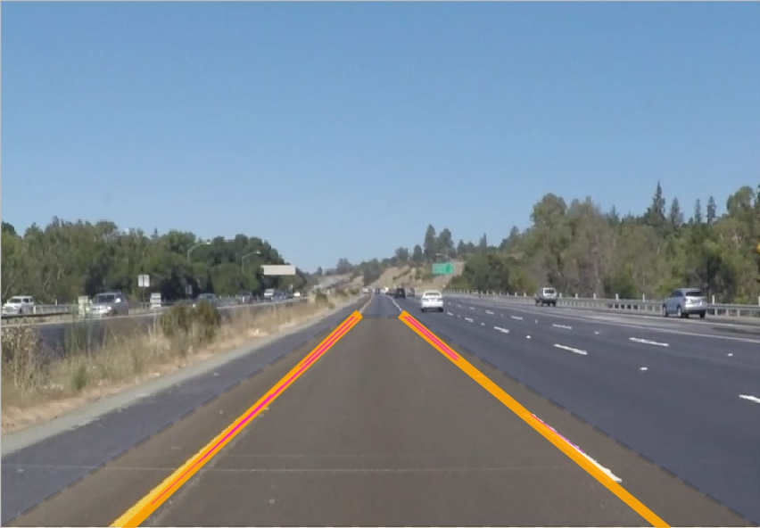

# **Finding Lane Lines on the Road** 

This project aims to find lane lines in video taken from a roughly hood-mounted camera. Briefly, the pipeline uses Canny edge detection, Hough transform, and k-means clustering. Sliding-window averaging is used to smooth estimates when the pipeline is applied in a video context.

## Files included

* `README.md`: This file
* `P1.ipynb`: A report demonstrating the output on sample images and video, with inline explanations of the development.
* `P1.pdf`: A conversion of `P1.ipynb` with `nbconvert`.
* `laneLines.py`: All non-report code for the pipeline.
* `req.txt`: PIP requirements file.

Also included are the orignal sample images and videos, as well as their conversions.

* `test_images`: A collection of sample input images.
* `test_images_output`: Corresponding outputs.
* `test_videos`: A collection of sample input videos.
* `test_videos_output`: Corresponding outputs.
